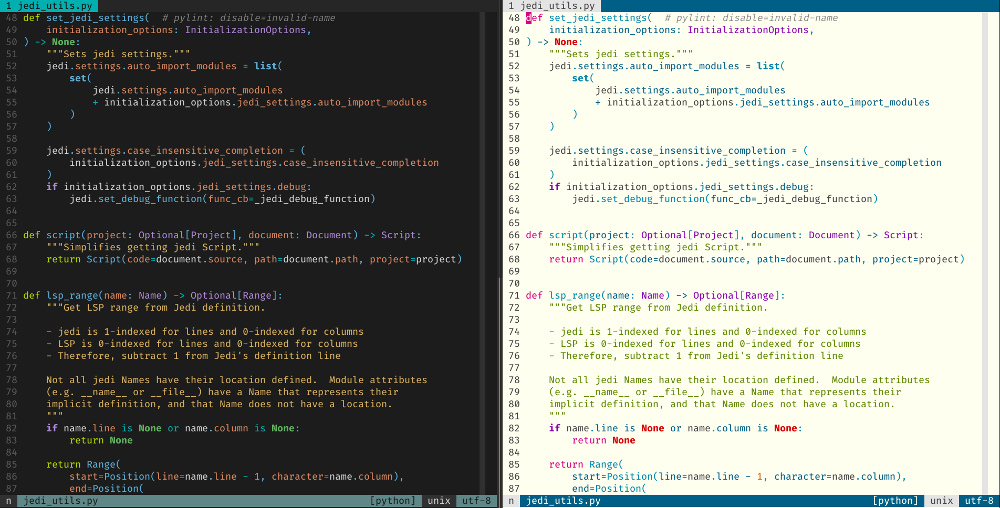

# PaperColorSlim Colorscheme

This is a slimmed down re-implementation of [papercolor-theme](https://github.com/NLKNguyen/papercolor-theme) that:

1. Supports [nvim-treesitter](https://github.com/nvim-treesitter/nvim-treesitter) for Neovim 0.8+.
2. Has no abstraction, making color mapping super simple.
3. Targets `gui` options (`guifg`, `guibg`, `gui`) with [truecolor](https://gist.github.com/sindresorhus/bed863fb8bedf023b833c88c322e44f9) support. If you're using a modern terminal ([alacritty](https://github.com/alacritty/alacritty), [iterm2](https://en.wikipedia.org/wiki/ITerm2), [gnome terminal](https://en.wikipedia.org/wiki/GNOME_Terminal), etc), you probably have `truecolor` support. Run `echo $COLORTERM` from your terminal. If it responds `truecolor`, you have `truecolor` support. NOTE: I'd be happy to add `cterm` support, if this interests you please submit a PR.
4. Limits highlight groups to: [built-in](https://neovim.io/doc/user/syntax.html#highlight-default), [preferred](https://neovim.io/doc/user/syntax.html#W18), and [nvim-treesitter](https://github.com/nvim-treesitter/nvim-treesitter/blob/333e1ab7768336d33c0e654a412ce0cb763f1da2/doc/nvim-treesitter.txt#L398). This results in consistent highlighting across languages, but may sacrifice highlighting granularity in some cases.
5. Supports both `background=light` and `background=dark`.

It targets Neovim's syntax groups, but it should technically also work with Vim. The following screenshot shows the dark (default) and light variants operating on same Python file (from [jedi-language-server](https://github.com/pappasam/jedi-language-server)). If you write another language, don't worry: PaperColorSlim supports them all!


## Installation

If using [vim-plug](https://github.com/junegunn/vim-plug):

```vim
Plug 'pappasam/papercolor-theme-slim'
```

Then run the Ex command:

```vim
:PlugInstall
```

I personally use [vim-packager](https://github.com/kristijanhusak/vim-packager), so if you'd like to go down the "package" rabbit hole, I suggest giving that a try.

## Dark and light

We use the dark variant by default:

```vim
colorscheme PaperColorSlim
```

The light variant can be used at start-up by setting `background=light` before loading this colorscheme.

```vim
set background=light
colorscheme PaperColorSlim
```

You may change to the light/dark variant at any time by running `:set background=light` or `:set background=dark`

## Customization

You can configure virtually anything you want with Vim's native syntax highlighting tooling and autocmds. What follows are some common configuration customizations requested by users, along with their solution.

### Transparent background

Some users want the background of their Vim to match their terminal's background color. To achieve this with PaperColorSlim, put the following code somewhere in your `vimrc`:

```vim
augroup custom_papercolorslim_transparent_background
  autocmd!
  autocmd ColorScheme PaperColorSlim highlight Normal guibg=none
augroup end
```

**Note:** if your terminal background differs too much from [#1c1c1c](https://www.color-hex.com/color/1c1c1c) when using `background=dark`, or [#eeeeee](https://www.color-hex.com/color/eeeeee) when using `background=light`, PaperColorSlim may not contrast well with your terminal's background. In this case, you will need to do one of the following:

1. Use the PaperColorSlim-provided background colors (eg, don't put the above in your `vimrc`)
2. Perform further customization, tweaking `guifg` and `guibg` colors where necessary
3. Use a different Vim colorscheme that better-supports your background preferences

### Override color for only one &background type

Suppose, hypothetically, that you like the default guibg color for &background == 'dark' but want to change the guibg color for &background == 'light' to [#fffff0](https://www.color-hex.com/color/fffff0). You can do this by adding the following snippet to your vimrc:

```vim
augroup custom_papercolorslim_light_background
  autocmd!
  autocmd ColorScheme PaperColorSlim
        \ if &background == 'light' |
        \ execute 'highlight Normal guibg=#fffff0' |
        \ endif
augroup end
```

Notice how the light background is slightly different from the original while the dark background stays the same?



## Development

If you want to contribute and assuming you use Neovim, I suggest installing and using [nvim-colorizer](https://github.com/norcalli/nvim-colorizer.lua). It will let you see the colors associated with the hex codes, greatly simplifying development.

## Written by

Samuel Roeca _samuel.roeca@gmail.com_

Special thanks to [Nikyle Nguyen](https://github.com/NLKNguyen) and all their great work on [papercolor-theme](https://github.com/NLKNguyen/papercolor-theme) over the years!
