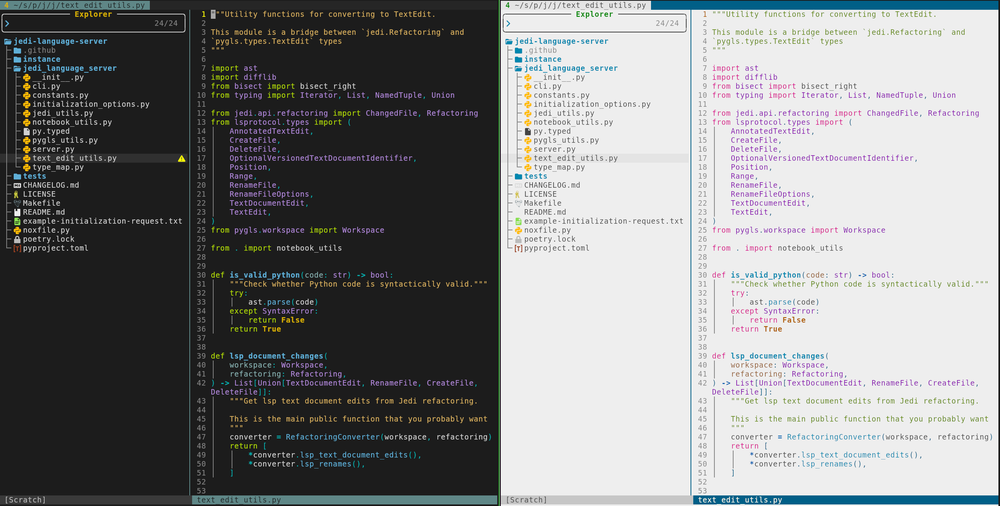

# PaperColorSlim Colorscheme

This is a slimmed down, [truecolor]-focused re-implementation of [papercolor-theme] that:

1. Has no abstraction, which simplifies user color mapping overrides.
2. Targets `gui` options (`guifg`, `guibg`, `gui`) with [truecolor] support. Run `echo $COLORTERM` from your terminal. If it responds `truecolor`, you have `truecolor` support.
3. Limited to the following highlight groups for consistentcy across languages
   - [built-in groups]
   - [preferred groups]
   - [lsp-semantic-highlight]
   - [diagnostic-highlight]
   - [nvim-treesitter highlights]
4. Supports both `background=light` and `background=dark`.

_NOTE: I'd be happy to add `cterm` support. If this interests you, please submit a Pull Request._

It targets Neovim's syntax groups, but it should technically also work with Vim. The following screenshot shows the dark (default) and light variants operating on same Python file. If you write another language, don't worry: PaperColorSlim supports them all!



## Installation

If using [vim-plug](https://github.com/junegunn/vim-plug):

```vim
Plug 'pappasam/papercolor-theme-slim'
```

Then run the Ex command:

```vim
:PlugInstall
```

I personally use [vim-packager](https://github.com/kristijanhusak/vim-packager), so if you'd like to go down the "package" rabbit hole, I suggest giving that a try.

## Dark and light

We use the dark variant by default:

```vim
colorscheme PaperColorSlim
```

The light variant can be used at start-up by setting `background=light` before loading this colorscheme.

```vim
set background=light
colorscheme PaperColorSlim
```

You may change to the light/dark variant at any time by running `:set background=light` or `:set background=dark`

## Customization

You can configure virtually anything you want with Vim's native syntax highlighting tooling and `autocmds`. What follows are some common configuration customization requests by users, along with their solution.

### Transparent background

Some users want the background of their Vim to match their terminal's background color. To achieve this with PaperColorSlim, put the following code somewhere in your `vimrc`:

```vim
augroup custom_papercolorslim_transparent_background
  autocmd!
  autocmd ColorScheme PaperColorSlim highlight Normal guibg=NONE
augroup end
```

**Note:** if your terminal background differs too much from [#1c1c1c](https://www.color-hex.com/color/1c1c1c) when using `background=dark`, or [#eeeeee](https://www.color-hex.com/color/eeeeee) when using `background=light`, PaperColorSlim may not contrast well with your terminal's background. In this case, you will need to do one of the following:

1. Use the PaperColorSlim-provided background colors (eg, don't put the above in your `vimrc`)
2. Perform further customization, tweaking `guifg` and `guibg` colors where necessary
3. Use a different Vim `colorscheme` that better-supports your background preferences

### Override color for only one &background type

Suppose, hypothetically, that you like the default `guibg` color for &background == 'dark' but want to change the `guibg` color for &background == 'light' to [#fffff0](https://www.color-hex.com/color/fffff0). You can do this by adding the following snippet to your vimrc:

```vim
augroup custom_papercolorslim_light_background
  autocmd!
  autocmd ColorScheme PaperColorSlim
        \ if &background == 'light' |
        \ execute 'highlight Normal guibg=#fffff0' |
        \ endif
augroup end
```

### Modify highlight linking

Sometimes you want to change the group that a plugin's matched group is linked to. Although this `colorscheme` doesn't handle that for you, it's trivial to do this linking yourself. Here are some examples from my vimrc for [gitsigns] and [nvim-tree]:

```vim
augroup custom_highlight_linking
  autocmd!
  autocmd ColorScheme PaperColorSlim
        \ highlight link GitSignsAddNr DiffAdd |
        \ highlight link GitSignsChangeNr DiffChange |
        \ highlight link GitSignsDeleteNr DiffDelete |
        \ highlight link GitSignsDeleteNr DiffDelete |
        \ highlight link NvimTreeExecFile PreProc |
        \ highlight link NvimTreeImageFile NONE |
        \ highlight link NvimTreeSpecialFile NONE |
        \ highlight link NvimTreeSymlink NONE
augroup end
```

## Development

If you want to contribute and assuming you use Neovim, I suggest installing and using [nvim-colorizer]. It will let you see the colors associated with the hex codes, greatly simplifying development.

## Credits

Special thanks to [Nikyle Nguyen] and all their great work on [papercolor-theme] over the years!

[Nikyle Nguyen]: https://github.com/NLKNguyen
[built-in groups]: https://neovim.io/doc/user/syntax.html#highlight-default
[gitsigns]: https://github.com/lewis6991/gitsigns.nvim
[lsp-semantic-highlight]: https://neovim.io/doc/user/lsp.html#_lsp-semantic-highlights
[nvim-colorizer]: https://github.com/NvChad/nvim-colorizer.lua
[nvim-tree]: https://github.com/nvim-tree/nvim-tree.lua
[nvim-treesitter highlights]: https://github.com/nvim-treesitter/nvim-treesitter/blob/master/CONTRIBUTING.md#highlights
[nvim-treesitter]: https://github.com/nvim-treesitter/nvim-treesitter
[papercolor-theme]: https://github.com/NLKNguyen/papercolor-theme
[preferred groups]: https://neovim.io/doc/user/syntax.html#group-name
[diagnostic-highlight]: https://neovim.io/doc/user/diagnostic.html#_highlights
[truecolor]: https://gist.github.com/sindresorhus/bed863fb8bedf023b833c88c322e44f9
